# Octave Band Filtering: Lab P -14

## Overview
This project focuses on the design and implementation of FIR bandpass filters in the analysis analysis of piano octave frequencies. This Process involved creating a filter Bank that contains seven of the octaves on the piano, leaving out the incomplete octaves on the lower and higher frequency range. With this filter bank, we can determine which octave an input signal lies in by analyzing the gain in frequency response to the filters in our filter bank.

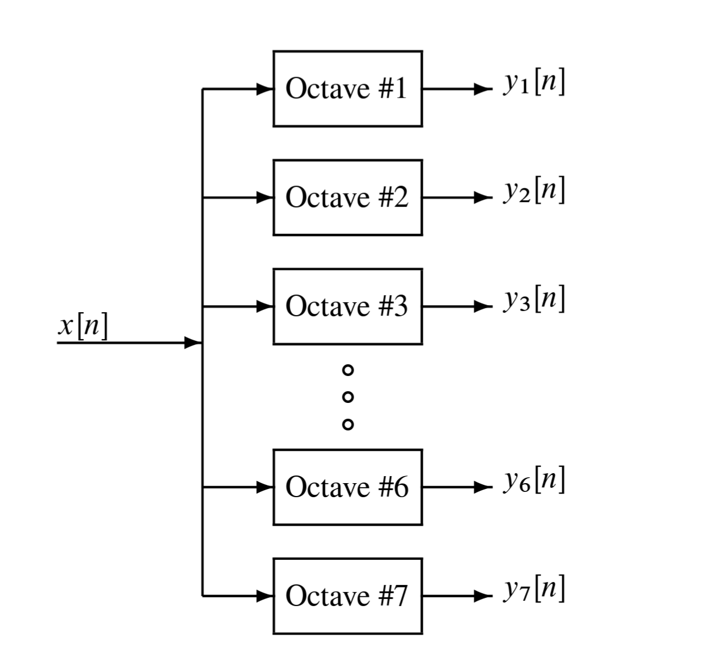
> Figure 1: Flow chart representing the method of filtering an input through each filter in the bank to determine the octave it lies in.

---

## Octave Frequencies
For the seven octaves, we created a data table listing the start and end points of each octave, which were then used to determine the center of each octave.

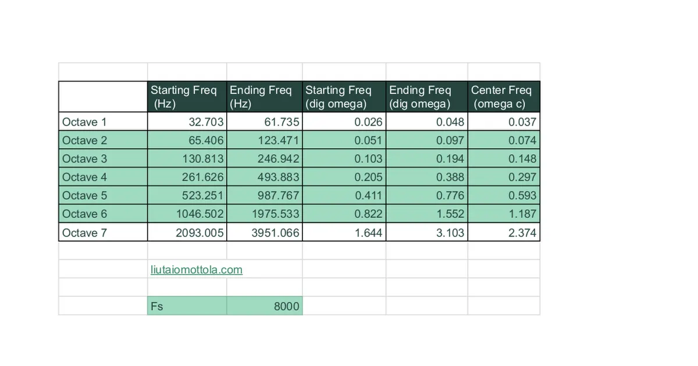
> Figure 2: Table of frequencies containing the start and end of the desired Octave passbands with the center of each respective passband.

---

## Filter Design

### Bandpass Filtering
Bandpass filtering was used as the method for our project because in the design of the filter you can define a specific cutoff frequency at the center of the passband. 

 $` h(n) = \frac{2}{L} \cos(\omega_c n), \quad 0 \leq n < L`$ 
> Impulse response for a simple BPF.

We design a filter with $` \omega_c = 0.4\pi `$ and $` L = 40 `$ and obtain its frequency response to demonstrate the basic principle behind this filtering process.

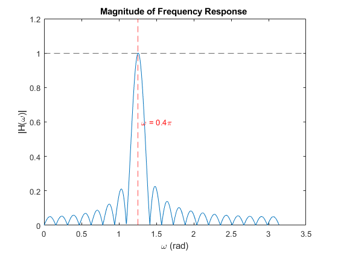 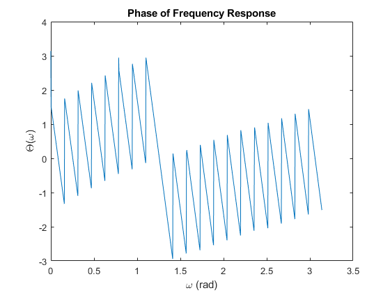
> Figure 3: Magnitude and Phase Response of the example simple bandpass filter.

The magnitude response here has notable side lobing, which will increase the threshold required to prevent noise to be present in any given output. Note that in the region of the passband, the phase response is linear since this is a linear FIR filter.

### Windowing
We can create a much better filter for our analysis if we can reduce the amplitude of the side lobes. This is possible by using a windowing function. Our example of a better BPF uses a Hamming window. Note: on drawback of windowing is that it will also increase the width of the passband by a notable amount.

$` h(n) = (0.54 - 0.46 \cos[\frac{2\pi n}{L-1}]) \cos(\omega_c [n - \frac{L-1}{2}]), \quad 0 \leq n < L `$

Using this impulse response we design a filter where $` \omega_c = 0.25\pi `$ and $` L = 41 `$ to observe an example frequency response.

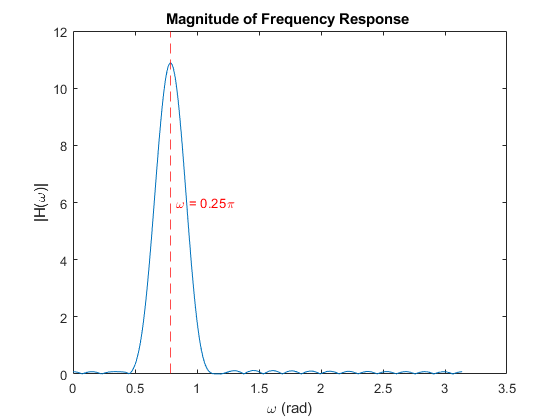 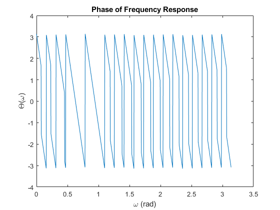
>Figure 4: Magnitude and Phase Response of the example better bandpass filter.

The width of the passband is larger in this case as observed by the magnitude response. Additionally, we can see the Hamming Window has split the phase response into two distinct linear responses. 

To reduce the passband width we can increase the length of our filter. Observe the magnitude response of an $` L = 81 `$ filter with the same value of $` \omega_c `$

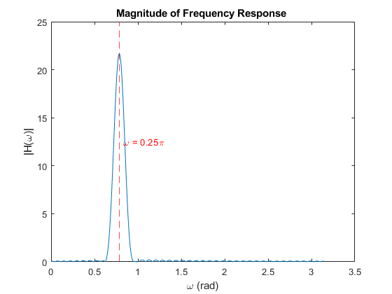
> Figure 5: Magnitude response of L = 81 filter.

### Normalization and Tuning
To control the amplitude of our output signals, we add a normalization constant $` \beta `$ to our impulse response function.

$` h(n) = \beta (0.54 - 0.46 \cos[\frac{2\pi n}{L-1}]) \cos(\omega_c [n - \frac{L-1}{2}]), \quad 0 \leq n < L `$

This effectively normalizes the maximum magnitude response to 1 for all of our filters to allow for better analysis. This process must be done for each filter in the filter bank by finding the maximum magnitude response of that filter and dividing the total magnitude response by that maximum. This was done for each octave. 

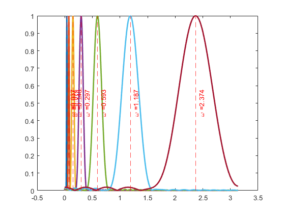
> Figure 5: Magnitude response of each filter in the filter bank.

We used an iterative process to determine the correct filter length for each octave.

---

## Analysis of Outputs From a Filter Bank Using Generated Inputs
### Testing the Integrity and Function of Filter Design
After creating a new 5 filter bank it was then used to decode which octave each of three input signals lie. These inputs were generated for a specific frequency range and each have an expected octave that they fall within. 

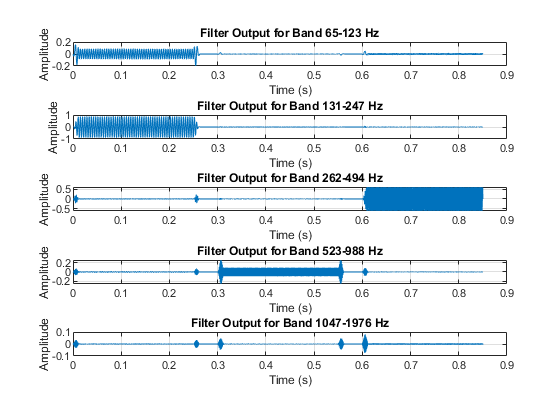
> Figure 6: Frequency response for each of the 5 filters.

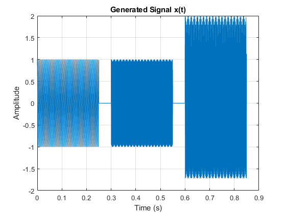
> Figure 7: A graph displaying the generated signals to filter.

We obesrved the frequency responses for each of the three inputs through the filter bank to validate which Octave they were within. An example for the first input, expected to pass in the third Octave, is shown in Figure 8.

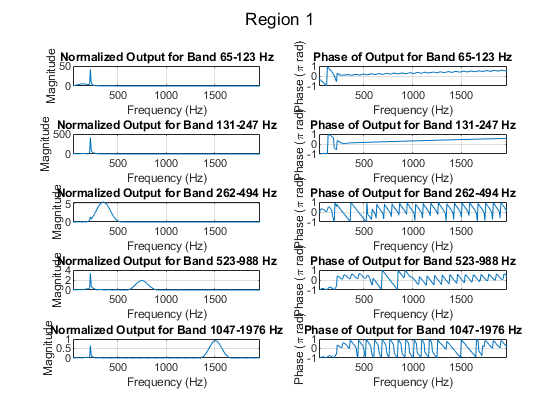
> Figure 8: Graph displaying the ouput response of each filter in the bank given the generated input.

Note that the filter response that has the larges magnitude of $`500 Hz`$ in the $`131-247 Hz`$ band corresponding to the thrid octave is greatly amplified compared to the outputs from each of the other filters. This indicates that the signal does indeed pass in the expected octave and our filters work as intended.

### Transient and Steady State Response in Output Response
To reduce the transient response in the outputs, it is important to observe the signal after $`12.5 ms `$ since that is when we observed the steady state response dominates from. Figure 9 shows an example of the transient and steady-state behavior of the outputs for each filter given the same input we used in the previous example.

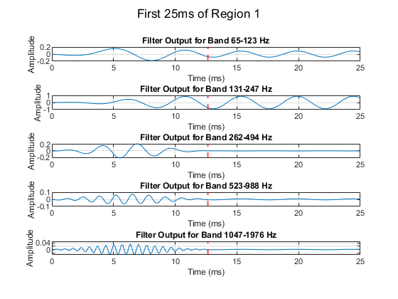
Figure 9: Graph displays the response over time for each of the five filters given the first generated input.

Something we notice here is that the output signal has some notable noise in the $`65-123 HZ`$ filter. This could be an issue with signal generation, or of filter length. This noise is overall small in the magnitude of the responses and isn't likely to cause an issue with analysis. Overall, the signal domiantes in the $`131-247 Hz`$ passband, as expected, and attentuates in all of the other octave filters still showing that the signal falls within the thrid octave. Further improvement of the process would evaluate the passband lengths from beginning to end and ensure that there isn't any notable octave overlap in the filter design.

---

## Appendix
### Running the Code
1. Ensure MATLAB/Octave is installed.  
2. Place all required files in the working directory, including:
   - `Bandpass_Filters.xlsx`
   - Custom functions: `BPFsimp.m`, `PBWidth.m`, `BPFbetter.m`, `HammingNorm.m`.  
3. Run the script to generate all figures and results.  

---

### Functions Used
1. **`BPFsimp(wc, L, N)`**  
   - Generates a simple bandpass filter.  
2. **`PBWidth(H, w, threshold)`**  
   - Calculates passband width based on a specified magnitude threshold.  
3. **`BPFbetter(wc, L, N)`**  
   - Generates an improved bandpass filter using a Hamming window.  
4. **`HammingNorm(wc, L, N)`**  
   - Designs normalized Hamming-windowed filters for octave bands.

---

### Results
- **Effect of $` L `$:**  
  Larger $` L `$ results in narrower passbands with higher gain.  
- **Improved Filter:**  
  Hamming window reduces side lobes, providing a cleaner passband.
- **Normalization:**  
  The constant $` \beta`$ effectively Normalizes each octave response maximum to unity.
- **Octave Band Filters:**  
  Successfully designed filters for seven octave bands, visualizing their response to a given input.

---

### Authors
Giovanni Gutierrez
David Needens
Cade Boynton
Katie Henn

---

### Refereneces
[1]Lab Provided within the OctaveBandFiltLab.pdf in the main directory of the project
[2]R. M. Mottola, “Liutaio Mottola Lutherie Information Website,” Liutaio Mottola Lutherie Information Website, 2024. https://liutaiomottola.com/ (accessed Dec. 02, 2024).

